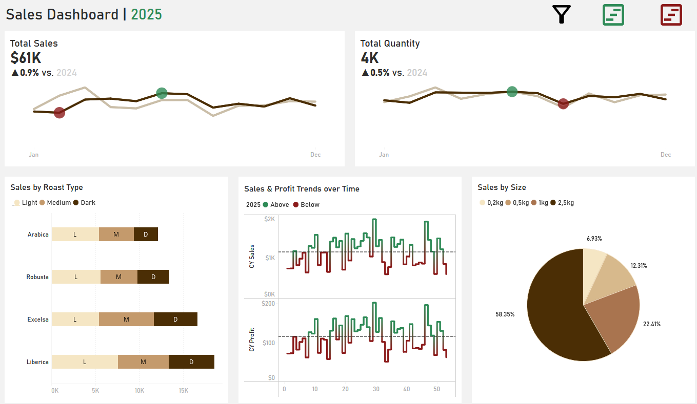
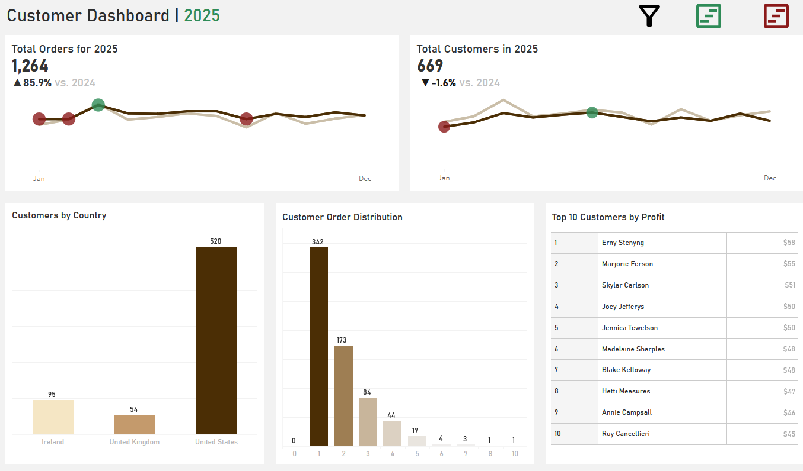

# Coffee Sales Dashboard

A Tableau portfolio project that turns coffee transaction data into an interactive sales dashboard. The project combines order, customer, and product information, with a focus on clear reporting and date filtering.
It aims to answer the following questions:
   1. **Product Mix Optimization**: Which specific combinations of coffee types, roast profiles, and package sizes are the primary revenue drivers, and how should this influence our inventory and procurement strategy?
   2. **Growth & Seasonality Intelligence**: How do sales and profit margins fluctuate annually and monthly, and what specific windows offer the greatest opportunity for high-impact seasonal promotions?
   3. **Customer Value & Geographic Footprint**: Where is our customer base most concentrated geographically, and how many high-value customers do we have?

[View the interactive dashboard on Tableau Public](https://public.tableau.com/app/profile/viktor.krstevski/viz/CoffeeShopDashboard_17615084777500/SalesDash)

------------------------------------------------------------------------------------------------------------------------------------------------------

**Tools:** Tableau Desktop / Tableau Public

## Dataset

| Measure | Coverage |
| --- | --- |
| Order dates | 2 January 2019 – 30 September 2026 |
| Order lines | 7,696 |
| Distinct order IDs | 7,653 |
| Customer records | 1,200 |
| Products | 48 |
| Countries | United States, Ireland, United Kingdom |
| Coffee types | Arabica, Robusta, Liberica, Excelsa |
| Roast codes | L, M, D |

The source contains three worksheets, each with an Excel table:

| Worksheet / table | Contents | Key |
| --- | --- | --- |
| `customers` / `Customers` | Customer name, city, country, postcode, and loyalty card status | `Customer ID` |
| `products` / `Products` | Coffee type, roast, size, unit price, price per 100g, and profit field | `Product ID` |
| `orders` / `Orders` | Order date, customer and product IDs, quantity, product attributes, unit price, and sales | Order line |

The order table already includes product attributes used for reporting. Customer and product IDs also connect each order line to the corresponding source records.

### Validation

The refreshed Excel source was checked for:

- Preservation of the original customer, product, and order values.
- Valid customer and product references for every added order.
- New IDs that do not collide with existing customer or order IDs.
- Actual date and numeric values, with a final order date of 30 September 2026.
- Positive quantities and new line sales matching quantity multiplied by unit price.
- Compatible worksheet names, column names, and Excel tables for the Tableau refresh.

Historical sales values were retained as supplied. Some differ slightly from quantity multiplied by the displayed, rounded unit price.

